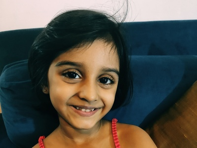
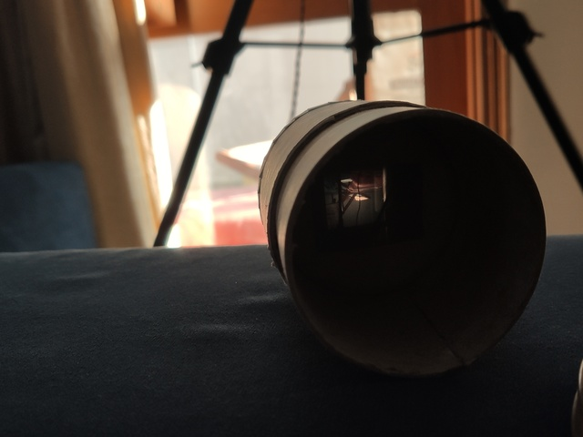
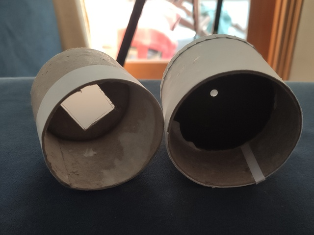
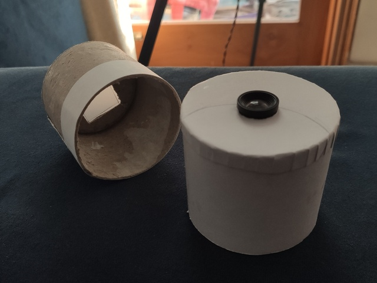
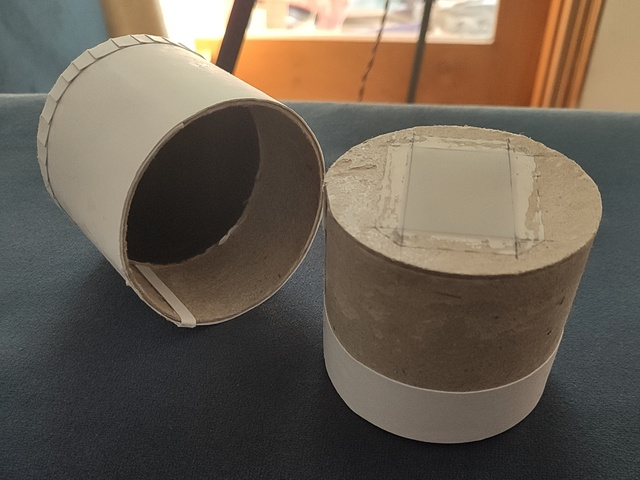
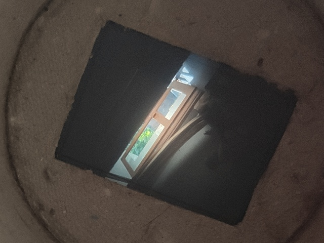

## IdaCam - A Raspberry Pi Zero W camera

This project is inspired by
[the Becca Cam](https://www.theverge.com/21306907/diy-camera-raspberry-pi-high-quality-how-to-build-video-c-cs-mount-lenses)
(by Becca Farsace @ The Verge) to create an interchangable lens camera using the
Rasberry Pi Zero W and the Raspberry Pi High Quality Camera module.

### The Name

The name comes as my daughter's name (exactly like Becca's Becca Cam).
The pronunciation of her name is _IPA: "ıːðɑː"_ and the pronunciation of cam is
exactly as it's written.

### Background/Motivation

My wife is a photographer (a great one), and my daughter has been seeing
a DSLR her whole life. She's even got a tiny canon toy camera with a detachable
lens, using which she re-enacts her mother's photo shoots.

Given her fascination with protography, I wanted to give her an interchangable
lens camera, but either they were too heavy for her or too expensive to give her
or both. I looked around for a lot of toy options, and nothing really hit the spot.
Looking at constucting a camera gave me the option of the Lomography Konstructor
series, but they're film cameras which is a problem again.

I had been experimenting with a Pi Z 1.3 (not a W) and found it to be very useful,
and easy to use. Then, when I came across Becca's article (and associated Youtube
video), I thought it was just the perfect thing to make for her. The price for all
parts was within USD 150, and the weight was well within her holding capacity.

This is now the way to create an interchangable lens camera from scratch for my
daughter while showing her the internals of a camera and educating her about `Making`.

### Hardware Requirements

- A [Raspberry Pi Zero W](https://www.raspberrypi.org/products/raspberry-pi-zero-w/).
  I got mine via redirect to a
  [official distributor](https://www.thingbits.net/t/categories/raspberry-pi/pi-zero-w?src=raspberrypi)
  from the Pi website. The price was reasonable.
- Screen
- Power
- Camera
- Lens
- Camera Cable
- Button
- [Jumper Cables(Thank you, Dupont)](https://www.google.com/search?&q=jumper+connectors), Female to Female
- 2.54 mm standard pitch male headers (correct terminology via [Digikey](https://www.digikey.com/catalog/en/search?filters=143632)):
  - one of 2 x 20, or
  - 2 of 1x20 (they'll come as a strip of 1x40) (Thank you for these, [Stuart](https://github.com/sturem/))
- Soldering Iron, Solder and YouTube.

### Log of the process

#### Hardware setup process
- Collect all the Hardware requirements
- Solder the headers to the raspberry pi Zero W. I found that using a bread board or an
  ATA connector to hold the pins and tying the Zero W against the pin holder using
  the end holes (which coincidentally line up perfectly with the header holes)
  allows for a well positioned set of pins. (TODO: add PIC)
- Connect the LCD module to the Zero W. (TODO: more details)
- Connect the the camera module to the Zero W

#### Pre-boot Software setup

- Download the [Raspberry Pi OS Lite](https://www.raspberrypi.org/downloads/raspberry-pi-os/)
  from the Rasberry Pi website and install it on a Micro SD card for the Pi Zero W.
- Mount the boot partition and
  - Enable SPI in the config.txt
  - Enable I2C in the config.txt
  - Enable the camera port in the config.txt (TODO: Give snippet)
  - Add the screen overlay to the config.txt (TODO: Give snippet)
  - Add the kernel command line params to the cmdline.txt (TODO: Give snippet)
- Mount the root FS partition and
  - add wifi configurations and priorities to `etc/wpa_supplicant/wpa_supplicant.conf`. (TODO: Give Details)
  - enable ssh service via systemd linking. (TODO: Give Details)

- Put in the SD card and boot up the W. Monitor the DHCP server to ensure that the the Zero W gets an IP address.

#### Post boot setup

Get into the Pi Zero W and do the following:

- Install the following packages:
  - `xserver-xorg-video-fbturbo` # display
  - `xserver-xorg-input-evdev` # Input from touch sensor, I think
  - `xinput-calibrator` # Calibration of input
  - `xinit`
  - `git` and `cmake`
  - `python3-picamera`
  - Optional:
    - `screen` (this is more convenience than requirement)

- Make and install `fbcp`:
  - `git clone` the repo `https://github.com/tasanakorn/rpi-fbcp/`
  - set up build with `cmake`
  - build it with `make`
  - Install `fbcp` into `/usr/local/bin/` (my preference, use any path dir based
    on yours)

- Set up framebuffer initialization in `/etc/rc.local`
  - ``
- Add configuration for fbturbo
- Add condifuration for evdev
- Enable terminal auto-login for user `pi`
- Add configuration for .session to start `xterm -ls screen`
- Add conditional `startx` into `~pi/.bashrc`

### Development steps

TODO

# TODO

- Add scripts to automate actions
- Investigate direct SPI display usage instead of HDMI display mirroring.

## Extras - The IdaCardboardCam

In an effort to get her to understand the concept of focusing the image with a
manual focus lens, I decided to build her a small cardboard camera, using
co-axially aligned cylinders(like a telescope), but using the lens from an old
dysfunctional point-and-shoot 35mm film camera that my mum had lying around.

We took it apart, showing her all the different parts, like the shutter, the
flash, and other parts of it, to extract the lens. The lens was a molded 3-lens
assembly which screwed onto the camera body, and was fixed with a bit of glue
once it was focussing the light at the correct place (where the current frame
of the film spool would be).

The outer cylinder had the lens affixed to it's front, and the inner cylinder
had a translucent plastic sheet (cut to the size of a single 35 mm film frame)
as the focus point for the image as captured by the lens. I added an insert
into the outer cylinder to disallow the inner cylinder from collapsing into the
outer completely and damaging the focus point/moving the lens out of alignment.

Pictures as below:

## License

Everything here is released under the HIRE ME/PAY ME License (a modified 2 Clause
BSD License). Please see the LICENSE file for details.

## References:

* [Google Fu(A BIG THANKS to the Google folks and Siva(HOD CSE IITB 2004))](https://www.google.com/)
* [Interactive Raspberry Pi Pinout](https://pinout.xyz/)
* [Waveshare LCD support repo](https://github.com/waveshare/LCD-show) - *WARNING: Doesn't work out of the box.*

* [Grove LED Button Schematic](https://wiki.seeedstudio.com/Grove-LED_Button/#schematic-online-viewer)
* [Random Button and LED tutorial for the RPi](https://www.electronicshub.org/raspberry-pi-push-button-interface/)
* [Raspberry Pi Camera Documentation](https://www.raspberrypi.org/documentation/accessories/camera.html)
* [Picamera Getting Started](https://picamera.readthedocs.io/en/release-1.13/quickstart.html)

* [WaveShare 3.2inch RPi LCD (B)](https://www.waveshare.com/wiki/3.2inch_RPi_LCD_(B))

* [RTC time with systemd on a Pi](https://learn.adafruit.com/adding-a-real-time-clock-to-raspberry-pi/set-rtc-time)

* [Raspicam commands](https://github.com/raspberrypi/documentation/blob/develop/documentation/asciidoc/accessories/camera/raspicam.adoc) and `raspistill --help`
* [Displaying an image on linux without running X](https://stackoverflow.com/questions/14211066/displaying-an-image-on-linux-without-running-x)
* [Open An Image on Host While SSH'ed?](https://raspberrypi.stackexchange.com/questions/96024/open-an-image-on-host-while-sshed)
